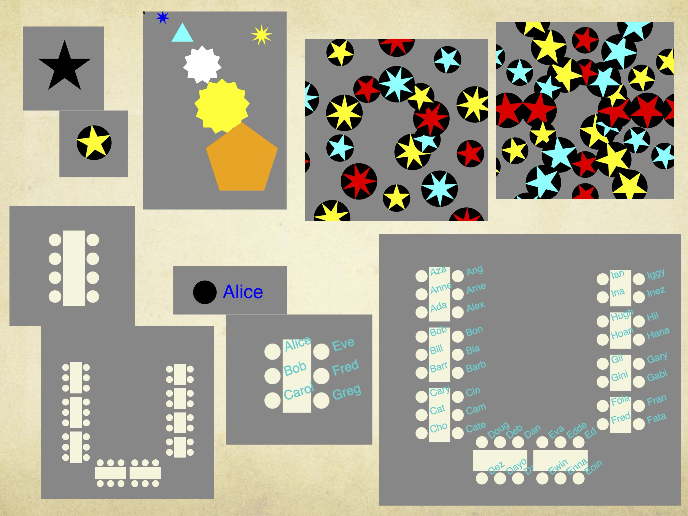
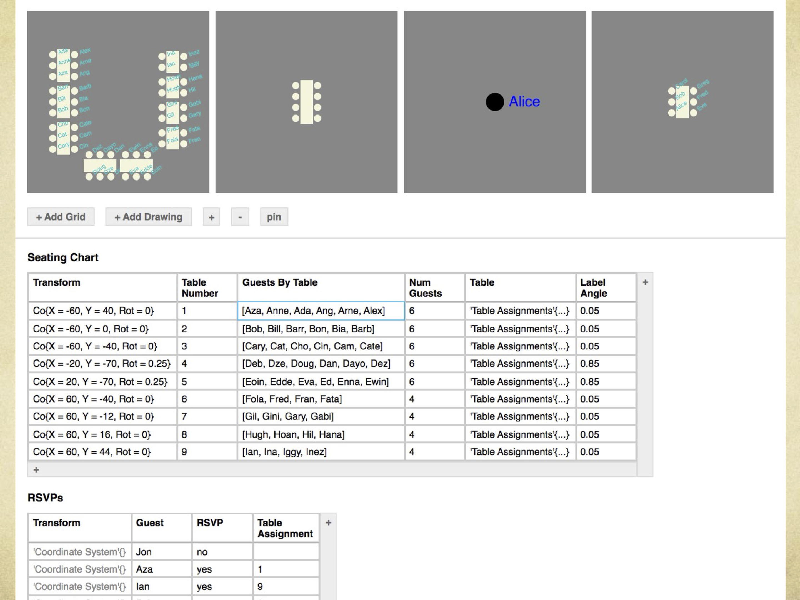

# DD: Adaptable Hierarchical Data Drawing

DD is a research project exploring how **data drawings** can be authored through a flexible, scalable data model.

A **data drawing** is a graphic structured by data: data visualizations, CAD drawings, GUIs, interactive digital art, and related forms all fit this framing. DD investigates how end users might author these drawings in a way that supports direct manipulation while still scaling to complex, reusable, hierarchical structures.

The central idea is simple: **drawings are data structures like any other.**

Rather than treating graphics as a separate layer with a specialized design language, DD adds drawing primitives as first-class types to a database-structured spreadsheet model augmented with user-defined types. Any data structure containing a drawing is itself a drawing. This lets drawings inherit the same powers as other structured data: composition, relation, hierarchy, reuse, inheritance, and adaptation.

## Motivation

Many procedural drawing and design tools are powerful, but their drawing models are often custom-built for a specific environment. D3, Excel charts, CAD tools, GUI builders, and creative coding systems each provide useful abstractions, but users must learn the drawing model on top of the host tool. These systems can also make it difficult to move fluidly between visible objects, underlying data, and reusable structure.

DD explores a different foundation: a data-first environment where graphics are data values like any others. The project considers UX problems that appear repeatedly in drawing tools and programming environments:

- How can users specify shapes and properties while also relating those properties to data?
- How can complex drawings be composed hierarchically instead of manually duplicated?
- How can reusable graphical abstractions remain visible, inspectable, and adaptable?
- How can an authoring environment move between spreadsheet-like editing and direct graphical manipulation without changing the underlying representation?

### Some drawings made in DD

### A screenshot of using DD to plan a wedding seating chart

## Modeling approach

DD extends the **database-structured spreadsheet** (DSS) model that has become popular in end-user-programming tools like Airtable and Coda. In this model, tables have typed columns, cell values can be literal or calculated, and formulas for calculations are shared across a column. This has a natural interpretation as a relational database.

DD augments this DSS foundation in 3 simple ways that compose powerfully:
1. DD recognizes that **tables are user-defined types** and lets these extend the built-in type system
2. DD ensures **every language construct has a default value**
3. To introduce drawings to DD, **drawing primitives are first-class members of the type system**

### Tables are user-defined types

User-defined hierarchical data types appear naturally by recognizing that each spreadsheet table defines a new data type, and each row is an instance of that type. The schema of a table is a dictionary type that names to types. By authoring tables, users extend DD's built-in data types.

DD takes this further to allow type extension and user-defined functions. Both are simple:
- A table can extend an existing table, including built-in tabular types. It can add new columns. It can override per-column values, types, and formulas of the parent table so long as it does not violate the parent table's type contract. Instances of the child type can be used wherever instances of the parent type are expected. All of this follows well-trodden type theory principles.
- A user-defined function is simply sugar for a table type plus a column projection. Note that a table type is simply a function from free parameters to a table instance. Projecting a single column from that table instance allows defining a function with an arbitrary return type.

**For spreadsheet fans:** This achieves user-defined hierarchical data types and functions in a spreadsheet.

**For object-oriented programming fans:** This achieves a spreadsheet-style UI for working with immutable class hierarchies. Introducing state mutation would recover a full OOP programming model.

### Every language construct has a default value

This simple choice removes a huge swath of validity and usability problems that plague standard DSS systems. A common problem in DSS products is that a user must finish filling out a row's values before the row is valid, but creating a row and filling in its values is not a single atomic action. This creates a nightmare of invalid value tracking and brittle consistency-bandaids that propagates through formulas, aggregations, visualizations, etc.

In DD, it is impossible to construct an incomplete or invalid value, function, or type definition, and it is impossible to define function or type that does not have a concrete representation.  All built-in types have default values, e.g. `0` is the default number and `[]` is the default list. Since any new type (including a function) is a composition of existing types, the new type can be immediately instantiated with the default values of its composite types. The default values for the new type are these inherited defaults except where a new default is specified. Specifying custom defaults simply means filling out values in a special row that specifies the table's default values.

This stability and concreteness is an excellent foundation for direct-manipulation. Additionally, by modeling everything in a concise type system design, direct-manipulation widgets can be associated with each foundational mechanism of the type system. Direct manipulation UI can then be generated automatically for even complex data-driven drawings, with user-overrides available to reduce UI noise.

### Drawing primitives are first-class members of the type system

Adding drawings to DD is now the simplest thing: a Shape type is added to the type system, and for every instance of Shape, a canvas renders the drawing specified by that instance's data. The Shape type natively supports properties like position, fill, and rotation, and it can be extended and composed like any other type to allow definitions of lines, circles, stars, or anything else. Any type that extends or composes a shape type is itself a shape type.

While a single global canvas is easily polluted with scratchwork and intermediate shapes, minor additional mechanisms like per-table canvases and drawing hiding enable effective canvas management.

## Demonstrations

### Demo 1: Drawing a circus ball

The first demo shows how simple it is to build drawings from primitive shapes in a spreadsheet-like model. A user starts with a primitive shape in a cell, adjusts it with parameters, adds calculated shapes in new columns, composes the newly-defined shape like any other, and adds more rows to vary the result. This creates spectacles of novel circus ball drawings.

### Demo 2: Wedding seating chart synchronized to RSVPs

The complex demo builds a wedding seating chart drawing from RSVP data. This shows how readily data-driven drawings can be integrated into existing application data from diverse scenarios like event planning, project management, etc.

**→ Demo Video:** For a 12-second video, see . This video is sped up 40x. At normal speed, this demo takes 8 minutes.

This showcases an iterative hierarchical drawing process that works with a meaningful data source:

1. Define a custom `Dining Table` shape by composing circles and a rectangle.
2. Use the guest list to generate multiple dining tables with variable numbers of seats, then arrange the table positions by hand.
  - Users can easily intermingle data-driven automations and manual adjustments without getting "locked in" to either mode.
3. Introduce a new type for labeling a chair with a name.
4. Extend the table shape to labels chairs with guest names, and compose this into the master seating chart.
5. Tweak the final text layout so that each name is easy to read.

This example illustrates the project’s broader claim: there should be no hard boundary between "the drawing" and "the data behind the drawing." DSS-based platforms like Coda have shown that many of today's siloed applications could instead live in a common end-user-programming workspace. A seating chart need not be an exception: instead of being siloed in a specialized drawing tool, a seating chart can share the same workspace that holds the RSVP tracker, day-of logistics, and financial planner.

## Project status and direction

All demos and comparable functionality are robustly supported by the DD codebase. No special-case handling or other trickery went into these demos.

Performance has not been invested in. The application becomes painfully slow with 500 shapes.

Direct-manipulation graphical authoring of shapes has been planned but not implemented.

## The grand dream

In the ambitious trajectory, this is the first of 5 steps towards an ecosystem of open-source applications that transparently allow end-user remixing that enters through the user interface instead of the code interface. Users already know a tremendous amount about their software and what they want, but it is all described in terms of the user interfaces they experience. If they could adapt and remix apps using a design language focused on these user interfaces, the end-user programming promise of open source software would be far more widely practiced.

Here is that 5-step plan:
1. **DONE:** Support end-user authoring of general-purpose data drawings in a computational notebook
2. Demonstrate direct manipulation graphical authoring with equal power to compose, relate, and adapt drawings
3. Generalize this work into low/no-code authoring of *interactive* graphics, particularly GUIs
4. Grow an ecosystem that supports direct manipulation end-user adaptation of what users know about their apps
5. Make it practical for professional developers to build and maintain applications that end users adapt
